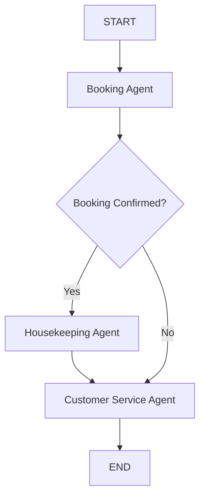

# 🏨 Multi-Agent Hotel Management System  
**Async LangGraph • Pydantic State • EPAM DIAL Integration**

---

## 📌 Overview

This project implements a **multi-agent hotel management system** using **LangGraph** and **async Python agents**.  
It demonstrates agent orchestration, shared state management, and AI-powered customer communication using **EPAM DIAL**.

The system simulates a real-world hotel workflow with clear separation of concerns and deterministic routing.

---

## 🎯 Learning Objectives

- Build an **async multi-agent system** using LangGraph  
- Implement **shared Pydantic state** across agents  
- Design **deterministic routing logic**  
- Integrate **EPAM DIAL** for AI-generated responses  
- Demonstrate **clean, extensible architecture**

---

## 🧱 System Architecture

### Core Agents

| Agent | Responsibility |
|------|---------------|
| **Booking Agent** | Checks availability, prevents double booking, creates reservations |
| **Housekeeping Agent** | Prepares rooms after confirmed bookings |
| **Customer Service Agent** | Generates customer-facing responses using EPAM DIAL |

---

### Orchestration Layer

- **LangGraph** manages agent execution
- Routing decisions are **deterministic** (not AI-based)
- Agents operate on a **shared Pydantic `HotelState`**

---

## 🔁 Workflow



If booking fails, the workflow routes directly to **Customer Service**.

---

## 🧠 State Management

The system uses a shared `HotelState` object that contains:

- Booking status & details
- Housekeeping status
- Customer service messages
- Error tracking

Each agent updates **only its own sub-state**, ensuring clean boundaries and predictable behavior.

---

## 💾 Booking Persistence Strategy

To prevent double booking across multiple runs, the system uses **JSON-based persistence**.

### How it works:
- Booked rooms are stored in `src/data/booked_rooms.json`
- On startup, booked rooms are loaded into memory
- When a booking is confirmed, the room is persisted

### Why JSON Persistence?
- Lightweight and simple
- No database dependency
- Easy to explain and extend
- Ideal for assignment scope

---

## ⚠️ Intentional Limitations

The following limitations are **intentional and acceptable** for this assignment:

- Bookings do **not expire automatically**
- No date-based availability logic
- No concurrency locking
- JSON persistence is local to the project

### Design Rationale

> The goal is to demonstrate multi-agent orchestration and state management rather than full hotel inventory lifecycle management.  
> The design is intentionally simple but easily extensible.

---

## 🔑 EPAM DIAL Integration

- EPAM DIAL is used **only** in the Customer Service Agent
- AI generates professional, contextual customer responses
- Core business logic remains **deterministic**

This ensures:
- Predictable system behavior
- Responsible AI usage
- Clear separation of logic and language generation

---

## 🚀 Running the Project

### 1️⃣ Environment Setup

```bash
python -m venv venv
venv\Scripts\activate
pip install -r requirements.txt

## 🔧 Environment Configuration

Create a `.env` file in the project root:

- DIAL_API_KEY=your_dial_api_key_here

## 🚀 Running the Application

- Run the application:

- python -m src.main


- Run with debug output enabled:

- python -m src.main --debug


- View available CLI options:

- python -m src.main --help

### 🧪 Example Output
- 🏨 Booking confirmed: Room 201
- 🧹 Room cleaned and ready
- 🎧 AI-generated customer confirmation message

---

## 🧠 Key Design Decisions

- Async agents for scalability

- Deterministic routing instead of AI-based decisions

- Shared Pydantic state across agents

- JSON persistence instead of a database

- AI limited to customer-facing communication only

---

## 🔮 Future Enhancements (Out of Scope)

- Date-based booking expiry

- Booking cancellation

- Database persistence

- Concurrent booking safety

- Admin dashboards